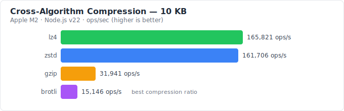
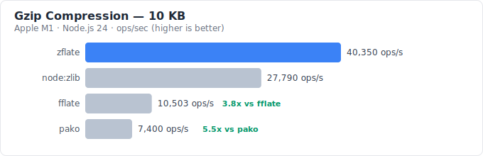
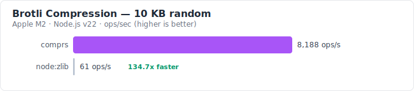

<div align="center">

# comprs

Rust-powered universal compression for JavaScript/TypeScript.
**zstd**, **gzip**, **brotli**, and **lz4** in one package.

[](https://www.npmjs.com/package/comprs)
[](https://www.npmjs.com/package/comprs)
[](https://github.com/derodero24/comprs/actions/workflows/ci.yml)
[](https://codecov.io/gh/derodero24/comprs)
[](https://codspeed.io/derodero24/comprs)
[](LICENSE)
[](https://nodejs.org/)
[](https://www.typescriptlang.org/)
[](https://derodero24.github.io/comprs/)

**[→ Try the live playground](https://derodero24.github.io/comprs/)**

</div>

## Table of Contents

- [Why comprs?](#why-comprs)
- [Comparison with Alternatives](#comparison-with-alternatives)
- [Installation](#installation)
- [Quick Start](#quick-start)
- [Choosing an Algorithm](#choosing-an-algorithm)
- [API](#api)
- [Supported Algorithms](#supported-algorithms)
- [Platform Support](#platform-support)
- [Browser Usage](#browser-usage)
- [Migration](#migration)
- [Benchmarks](#benchmarks)
- [Contributing](#contributing)

## Why comprs?

The JavaScript compression ecosystem is fragmented across 12+ packages with inconsistent APIs, mixed maintenance status, and no streaming support. comprs consolidates this into a single, fast, well-typed library:

- **Native performance** — Rust core compiled via napi-rs, with WASM fallback for browsers
- **Unified API** — Same interface for zstd, gzip, brotli, and lz4
- **Streaming** — Web Streams API (`TransformStream`) for processing large data with bounded memory
- **Universal** — Node.js (native), browsers, Deno, and Bun (WASM)
- **Zero JS dependencies** — Only Rust and the platform
- **Interactive playground** — [Try any algorithm live in your browser](https://derodero24.github.io/comprs/), no install needed

## Comparison with Alternatives

| Feature | comprs | pako | fflate | node:zlib |
| --- | :---: | :---: | :---: | :---: |
| zstd | ✅ | ❌ | ❌ | ⚠️ Experimental* |
| gzip/deflate | ✅ | ✅ | ✅ | ✅ |
| brotli | ✅ | ❌ | ❌ | ✅ |
| lz4 | ✅ | ❌ | ❌ | ❌ |
| Web Streams API | ✅ | ❌ | ❌ | ❌ |
| Node.js Transform | ✅ | ❌ | ❌ | ✅ |
| Streaming | ✅ | Chunked† | ✅ | ✅ |
| Browser | ✅ | ✅ | ✅ | ❌ |
| Deno/Bun | ✅ | ✅ | ✅ | ❌ |
| Native performance | ✅ | ❌ | ❌ | ✅ |
| TypeScript | ✅ | ✅ | ✅ | ✅ |
| Dictionary | ✅ (zstd + brotli) | ❌ | ❌ | ❌ |
| Zero JS deps | ✅ | ✅ | ✅ | ✅ |

\* `node:zlib` zstd support requires Node.js ≥ 22.15 and is experimental
† pako uses chunked `Inflate`/`Deflate` classes, not the Web Streams API

## Installation

```bash
npm install comprs
# or
pnpm add comprs
# or
yarn add comprs
# or
bun add comprs
```

## Quick Start

> **Try it live** → [derodero24.github.io/comprs](https://derodero24.github.io/comprs/)

```typescript
import { zstdCompress, zstdDecompress } from 'comprs';

const data = Buffer.from('Hello, comprs!');
const compressed = zstdCompress(data);
const decompressed = zstdDecompress(compressed);
```

All algorithms use the same pattern:

```typescript
import { gzipCompress, brotliCompress, lz4Compress } from 'comprs';

const gzipped = gzipCompress(data);    // gzip
const brotlied = brotliCompress(data); // brotli
const lz4ed = lz4Compress(data);       // lz4
```

### Streaming (Web Streams API)

```typescript
import { createGzipCompressStream, createGzipDecompressStream } from 'comprs/streams';

// Pipe through compression/decompression TransformStreams
const compressed = response.body
  .pipeThrough(createGzipCompressStream());
```

### Streaming (Node.js Transform)

```typescript
import { createGzipCompressTransform } from 'comprs/node';
import { pipeline } from 'node:stream/promises';
import { createReadStream, createWriteStream } from 'node:fs';

await pipeline(
  createReadStream('input.txt'),
  createGzipCompressTransform(),
  createWriteStream('output.gz'),
);
```

### Auto-detect

```typescript
import { decompress } from 'comprs';

// Works with any supported format — no need to know the algorithm
const decompressed = decompress(compressedData);
```

### Async

```typescript
import { gzipCompressAsync, gzipDecompressAsync } from 'comprs';

// Runs on the libuv thread pool — keeps the event loop free
const compressed = await gzipCompressAsync(largeData);
const decompressed = await gzipDecompressAsync(compressed);
```

### Compression levels

```typescript
import { zstdCompress } from 'comprs';

zstdCompress(data, 1);   // fast compression
zstdCompress(data);      // default (level 3)
zstdCompress(data, 22);  // best compression
zstdCompress(data, -1);  // fast mode with negative levels
```

### Dictionary compression

```typescript
import { zstdTrainDictionary, zstdCompressWithDict, zstdDecompressWithDict } from 'comprs';

// Train from samples of similar data
const dict = zstdTrainDictionary(samples);

// Compress/decompress with dictionary
const compressed = zstdCompressWithDict(data, dict);
const decompressed = zstdDecompressWithDict(compressed, dict);
```

```typescript
// Brotli dictionary (no training step — provide raw dictionary bytes)
import { brotliCompressWithDict, brotliDecompressWithDict } from 'comprs';

const dict = Buffer.from('{"id":0,"name":"","email":"@example.com"}'.repeat(10));
const compressed = brotliCompressWithDict(data, dict);
const decompressed = brotliDecompressWithDict(compressed, dict);
```

### Deno / Bun

```typescript
// Deno
import { gzipCompress } from 'npm:comprs';

// Bun (same as Node.js)
import { gzipCompress } from 'comprs';
```

## Choosing an Algorithm

| Use case | Recommended | Why |
| --- | --- | --- |
| Web asset delivery (CDN, HTTP) | **brotli** | Best compression ratio; native browser `Accept-Encoding` support |
| General-purpose file compression | **zstd** | Fastest all-round with excellent compression ratio |
| Real-time data / logging / IPC | **lz4** | Lowest latency; optimized for speed over ratio |
| Legacy systems / maximum compatibility | **gzip** | Universal support; every tool and platform can decompress |
| Many small similar records (JSON, logs) | **zstd + dictionary** | Dictionary pre-seeds the compressor with expected patterns |
| Brotli with domain-specific data | **brotli + dictionary** | Custom dictionary for repeated structures without training |

### Choosing an API mode

| Mode | When to use |
| --- | --- |
| **Sync** (`zstdCompress`) | Small data (< 1 MB), low-latency requirements, scripts |
| **Async** (`zstdCompressAsync`) | Large data or when event loop must stay free (servers, UIs) |
| **Streaming** (`createZstdCompressStream`) | Unknown/unbounded data size, memory-constrained environments |
| **Dictionary** (`zstdCompressWithDict`) | Compressing many small, structurally similar items |

## API

### One-shot

#### zstd

| Function | Description |
| --- | --- |
| `zstdCompress(data, level?)` | Compress with zstd. Level: -131072 to 22 (default: 3) |
| `zstdDecompress(data)` | Decompress zstd data (max 256 MB output) |
| `zstdDecompressWithCapacity(data, capacity)` | Decompress with explicit output size limit |

#### gzip / deflate

| Function | Description |
| --- | --- |
| `gzipCompress(data, level?)` | Compress with gzip. Level: 0-9 (default: 6) |
| `gzipCompressWithHeader(data, header, level?)` | Compress with custom gzip header (filename, mtime) |
| `gzipReadHeader(data)` | Read gzip header metadata without decompressing |
| `gzipDecompress(data)` | Decompress gzip data |
| `gzipDecompressWithCapacity(data, capacity)` | Decompress with explicit output size limit |
| `deflateCompress(data, level?)` | Compress with raw deflate. Level: 0-9 (default: 6) |
| `deflateDecompress(data)` | Decompress raw deflate data |
| `deflateDecompressWithCapacity(data, capacity)` | Decompress with explicit output size limit |

#### brotli

| Function | Description |
| --- | --- |
| `brotliCompress(data, quality?)` | Compress with brotli. Quality: 0-11 (default: 6) |
| `brotliDecompress(data)` | Decompress brotli data (max 256 MB output) |
| `brotliDecompressWithCapacity(data, capacity)` | Decompress with explicit output size limit |

#### lz4

| Function | Description |
| --- | --- |
| `lz4Compress(data)` | Compress with LZ4 frame format |
| `lz4Decompress(data)` | Decompress LZ4 data (max 256 MB output) |
| `lz4DecompressWithCapacity(data, capacity)` | Decompress with explicit output size limit |

#### Auto-detect

| Function | Description |
| --- | --- |
| `decompress(data)` | Auto-detect format and decompress (zstd, gzip, brotli, lz4) |
| `detectFormat(data)` | Detect compression format. Returns `'zstd'`, `'gzip'`, `'brotli'`, `'lz4'`, or `'unknown'` |

#### Utilities

| Function | Description |
| --- | --- |
| `crc32(data, initialValue?)` | Compute CRC32 checksum (supports incremental computation) |
| `version()` | Returns the library version |

<details>
<summary><strong>Dictionary API</strong></summary>

#### zstd Dictionary

| Function | Description |
| --- | --- |
| `zstdTrainDictionary(samples, maxDictSize?)` | Train a dictionary from sample data (default max: 110 KB) |
| `zstdCompressWithDict(data, dict, level?)` | Compress with pre-trained dictionary |
| `zstdDecompressWithDict(data, dict)` | Decompress dictionary-compressed data |
| `zstdDecompressWithDictWithCapacity(data, dict, capacity)` | Decompress with dictionary and explicit output size limit |

#### Brotli Dictionary

| Function | Description |
| --- | --- |
| `brotliCompressWithDict(data, dict, quality?)` | Compress with custom dictionary |
| `brotliDecompressWithDict(data, dict)` | Decompress dictionary-compressed data |
| `brotliDecompressWithDictWithCapacity(data, dict, capacity)` | Decompress with explicit capacity |

</details>

### Async

All one-shot functions have async variants that run on the libuv thread pool. Append `Async` to any function name:

```typescript
const compressed = await zstdCompressAsync(data, level);
const decompressed = await gzipDecompressAsync(compressed);
```

<details>
<summary><strong>Full async API list</strong></summary>

| Function | Description |
| --- | --- |
| `zstdCompressAsync(data, level?)` | Async zstd compression |
| `zstdDecompressAsync(data)` | Async zstd decompression |
| `zstdDecompressWithCapacityAsync(data, capacity)` | Async zstd decompression with explicit size limit |
| `zstdCompressWithDictAsync(data, dict, level?)` | Async zstd compression with dictionary |
| `zstdDecompressWithDictAsync(data, dict)` | Async zstd decompression with dictionary |
| `zstdTrainDictionaryAsync(samples, maxDictSize?)` | Async dictionary training |
| `gzipCompressAsync(data, level?)` | Async gzip compression |
| `gzipDecompressAsync(data)` | Async gzip decompression |
| `gzipDecompressWithCapacityAsync(data, capacity)` | Async gzip decompression with explicit size limit |
| `deflateCompressAsync(data, level?)` | Async deflate compression |
| `deflateDecompressAsync(data)` | Async deflate decompression |
| `deflateDecompressWithCapacityAsync(data, capacity)` | Async deflate decompression with explicit size limit |
| `brotliCompressAsync(data, quality?)` | Async brotli compression |
| `brotliDecompressAsync(data)` | Async brotli decompression |
| `brotliDecompressWithCapacityAsync(data, capacity)` | Async brotli decompression with explicit size limit |
| `brotliCompressWithDictAsync(data, dict, quality?)` | Async brotli compression with dictionary |
| `brotliDecompressWithDictAsync(data, dict)` | Async brotli decompression with dictionary |
| `lz4CompressAsync(data)` | Async LZ4 compression |
| `lz4DecompressAsync(data)` | Async LZ4 decompression |
| `lz4DecompressWithCapacityAsync(data, capacity)` | Async LZ4 decompression with explicit size limit |
| `decompressAsync(data)` | Async auto-detect format and decompress |

</details>

### Streaming

Web Streams API (`TransformStream`) for all algorithms. Import from `comprs/streams`:

```typescript
import { createGzipCompressStream } from 'comprs/streams';
```

<details>
<summary><strong>Full streaming API list</strong></summary>

| Function | Description |
| --- | --- |
| `createZstdCompressStream(level?)` | Create a zstd compression `TransformStream` |
| `createZstdDecompressStream()` | Create a zstd decompression `TransformStream` |
| `createGzipCompressStream(level?)` | Create a gzip compression `TransformStream` |
| `createGzipDecompressStream()` | Create a gzip decompression `TransformStream` |
| `createDeflateCompressStream(level?)` | Create a raw deflate compression `TransformStream` |
| `createDeflateDecompressStream()` | Create a raw deflate decompression `TransformStream` |
| `createBrotliCompressStream(quality?)` | Create a brotli compression `TransformStream` |
| `createBrotliDecompressStream()` | Create a brotli decompression `TransformStream` |
| `createLz4CompressStream()` | Create an LZ4 compression `TransformStream` |
| `createLz4DecompressStream()` | Create an LZ4 decompression `TransformStream` |
| `createZstdCompressDictStream(dict, level?)` | Streaming zstd compression with dictionary |
| `createZstdDecompressDictStream(dict)` | Streaming zstd decompression with dictionary |
| `createBrotliCompressDictStream(dict, quality?)` | Streaming brotli compression with dictionary |
| `createBrotliDecompressDictStream(dict)` | Streaming brotli decompression with dictionary |
| `createDecompressStream()` | Auto-detect format and create a decompression `TransformStream` |

</details>

### Node.js Transform Streams

For Node.js `stream.pipeline()` compatibility, import from `comprs/node`:

```typescript
import { createGzipCompressTransform } from 'comprs/node';
import { pipeline } from 'node:stream/promises';
import { createReadStream, createWriteStream } from 'node:fs';

await pipeline(
  createReadStream('input.txt'),
  createGzipCompressTransform(),
  createWriteStream('output.gz'),
);
```

<details>
<summary><strong>Full Node.js Transform API list</strong></summary>

| Function | Description |
| --- | --- |
| `createZstdCompressTransform(level?)` | Node.js Transform for zstd compression |
| `createZstdDecompressTransform()` | Node.js Transform for zstd decompression |
| `createGzipCompressTransform(level?)` | Node.js Transform for gzip compression |
| `createGzipDecompressTransform()` | Node.js Transform for gzip decompression |
| `createDeflateCompressTransform(level?)` | Node.js Transform for deflate compression |
| `createDeflateDecompressTransform()` | Node.js Transform for deflate decompression |
| `createBrotliCompressTransform(quality?)` | Node.js Transform for brotli compression |
| `createBrotliDecompressTransform()` | Node.js Transform for brotli decompression |
| `createLz4CompressTransform()` | Node.js Transform for LZ4 compression |
| `createLz4DecompressTransform()` | Node.js Transform for LZ4 decompression |
| `createZstdCompressDictTransform(dict, level?)` | Node.js Transform for zstd dict compression |
| `createZstdDecompressDictTransform(dict)` | Node.js Transform for zstd dict decompression |
| `createBrotliCompressDictTransform(dict, quality?)` | Node.js Transform for brotli dict compression |
| `createBrotliDecompressDictTransform(dict)` | Node.js Transform for brotli dict decompression |
| `createDecompressTransform()` | Auto-detect format and create a decompression Transform |

</details>

## Supported Algorithms

| Algorithm | One-shot | Streaming | Status |
| --- | --- | --- | --- |
| zstd | ✅ | ✅ | Available |
| gzip / deflate | ✅ | ✅ | Available |
| brotli | ✅ | ✅ | Available |
| lz4 | ✅ | ✅ | Available |

## Platform Support

| Platform | Backend | Status |
| --- | --- | --- |
| Node.js ≥ 20 | Native (napi-rs) | ✅ |
| Browsers | WASM | ✅ |
| Deno | WASM | ✅ |
| Bun | WASM | ✅ |

### Build targets

| OS | Architectures |
| --- | --- |
| macOS | Intel (x64), Apple Silicon (ARM64) |
| Linux | x64, ARM64 (glibc & musl) |
| Windows | x64, ARM64 |
| WASM | wasm32-wasip1-threads |

### WASM bundle size

The WASM binary (`wasm32-wasip1-threads`) is optimized with `wasm-opt -O3` during the build process. Binary size is tracked and reported in CI on every build — check the latest [CI run summary](https://github.com/derodero24/comprs/actions/workflows/ci.yml) for current numbers.

## Browser Usage

comprs works in browsers via WASM. Use a bundler like Vite, webpack, or esbuild:

```typescript
import { gzipCompress, gzipDecompress } from 'comprs';

const data = new TextEncoder().encode('Hello from the browser!');
const compressed = gzipCompress(data);
const decompressed = gzipDecompress(compressed);
```

> [!IMPORTANT]
> The WASM build uses `SharedArrayBuffer` for threading, which requires these HTTP headers on your page:
>
> ```http
> Cross-Origin-Opener-Policy: same-origin
> Cross-Origin-Embedder-Policy: require-corp
> ```
>
> Without these headers, you will see `SharedArrayBuffer is not defined`. See [MDN: SharedArrayBuffer](https://developer.mozilla.org/en-US/docs/Web/JavaScript/Reference/Global_Objects/SharedArrayBuffer#security_requirements) for details.

> [!TIP]
> WASM initialization happens automatically on first use. For performance-critical applications, consider warming up the module by calling any function once during app startup.

### Framework Integration (SSR)

Native modules need to be externalized in SSR frameworks:

**Next.js**

```js
// next.config.js
const nextConfig = {
  serverExternalPackages: ['comprs'],
};
```

**Vite SSR**

```js
// vite.config.js
export default {
  ssr: {
    external: ['comprs'],
  },
};
```

On the client side, comprs automatically falls back to WASM — no additional configuration needed beyond the SharedArrayBuffer headers above.

## Migration

### From pako

```diff
- import pako from 'pako';
- const compressed = pako.gzip(data);
- const decompressed = pako.ungzip(compressed);
+ import { gzipCompress, gzipDecompress } from 'comprs';
+ const compressed = gzipCompress(data);
+ const decompressed = gzipDecompress(compressed);
```

### From fflate

```diff
- import { gzipSync, gunzipSync } from 'fflate';
- const compressed = gzipSync(data);
- const decompressed = gunzipSync(compressed);
+ import { gzipCompress, gzipDecompress } from 'comprs';
+ const compressed = gzipCompress(data);
+ const decompressed = gzipDecompress(compressed);
```

comprs adds zstd, lz4, brotli, dictionary compression, and Web Streams API — none of which are available in fflate.

### From node:zlib

```diff
- import { gzipSync, gunzipSync } from 'node:zlib';
- const compressed = gzipSync(data);
- const decompressed = gunzipSync(compressed);
+ import { gzipCompress, gzipDecompress } from 'comprs';
+ const compressed = gzipCompress(data);
+ const decompressed = gzipDecompress(compressed);
```

## Benchmarks







Benchmarks run on Apple M2, Node.js v22. Run locally with `pnpm run bench`. Numbers vary by machine and data type.

<details>
<summary><strong>gzip: comprs vs pako vs fflate vs node:zlib</strong></summary>

**Compression** (ops/sec, higher is better)

| Size | comprs | pako | fflate | node:zlib |
| --- | ---: | ---: | ---: | ---: |
| 150B patterned | 1,352 | 1,578 | 7,785 | 13,078 |
| 10KB patterned | 3,605 | 133 | 345 | 1,878 |
| 1MB patterned | 246 | 14 | 11 | 100 |
| 150B random | 29,914 | 4,653 | 7,471 | 1,423 |
| 10KB random | 400 | 42 | 652 | 3,459 |
| 1MB random | 13 | 5 | 6 | 10 |

**Decompression** (ops/sec, higher is better)

| Size | comprs | pako | fflate | node:zlib |
| --- | ---: | ---: | ---: | ---: |
| 150B patterned | 162,220 | 65,141 | 521,933 | 308,493 |
| 10KB patterned | 95,300 | 19,235 | 46,402 | 102,585 |
| 1MB patterned | 903 | 123 | 310 | 1,451 |
| 150B random | 29,040 | 1,952 | 560,840 | 140,243 |
| 10KB random | 7,004 | 17,616 | 407,789 | 271,245 |
| 1MB random | 1,508 | 278 | 19,341 | 4,282 |

</details>

<details>
<summary><strong>deflate: comprs vs pako vs fflate vs node:zlib</strong></summary>

**Compression** (ops/sec, higher is better)

| Size | comprs | pako | fflate | node:zlib |
| --- | ---: | ---: | ---: | ---: |
| 150B patterned | 106,183 | 13,666 | 55,434 | 4,107 |
| 10KB patterned | 2,746 | 5,160 | 3,218 | 7,161 |
| 1MB patterned | 1,963 | 91 | 217 | 472 |
| 150B random | 56,537 | 18,763 | 51,817 | 89,617 |
| 10KB random | 7,331 | 1,500 | 510 | 1,941 |
| 1MB random | 21 | 8 | 24 | 22 |

**Decompression** (ops/sec, higher is better)

| Size | comprs | pako | fflate | node:zlib |
| --- | ---: | ---: | ---: | ---: |
| 150B patterned | 124,501 | 21,119 | 8,938 | 34,967 |
| 10KB patterned | 23,416 | 5,808 | 3,061 | 9,753 |
| 1MB patterned | 306 | 65 | 70 | 116 |
| 150B random | 35,178 | 11,449 | 204,088 | 91,795 |
| 10KB random | 7,986 | 13,079 | 62,782 | 114,130 |
| 1MB random | 610 | 350 | 238 | 176 |

</details>

<details>
<summary><strong>brotli: comprs vs node:zlib</strong></summary>

| Benchmark | comprs | node:zlib | Speedup |
| --- | ---: | ---: | ---: |
| compress 150B patterned | 24,811 | 2,258 | 11.0x |
| compress 10KB patterned | 15,357 | 1,498 | 10.2x |
| compress 1MB patterned | 659 | 70 | 9.5x |
| compress 150B random | 22,914 | 1,197 | 19.1x |
| compress 10KB random | 8,188 | 61 | 134.7x |
| compress 1MB random | 336 | 2 | 155.4x |
| decompress 150B patterned | 105,187 | 223,191 | 0.5x |
| decompress 10KB patterned | 28,509 | 46,967 | 0.6x |
| decompress 1MB patterned | 636 | 401 | 1.6x |
| decompress 150B random | 113,559 | 53,013 | 2.1x |
| decompress 10KB random | 1,503 | 1,156 | 1.3x |
| decompress 1MB random | 738 | 5,219 | 0.1x |

</details>

<details>
<summary><strong>Cross-algorithm comparison (comprs only)</strong></summary>

**Compression** (ops/sec, higher is better)

| Size | zstd | gzip | brotli | lz4 |
| --- | ---: | ---: | ---: | ---: |
| 150B patterned | 515,284 | 78,073 | 24,300 | 274,935 |
| 10KB patterned | 161,706 | 31,941 | 15,146 | 165,821 |
| 1MB patterned | 5,607 | 2,252 | 642 | 4,153 |
| 150B random | 643,393 | 69,616 | 23,634 | 97,111 |
| 10KB random | 129,576 | 31,525 | 13,411 | 74,162 |
| 1MB random | 4,320 | 2,262 | 478 | 5,419 |
| JSON 84KB | 8,914 | 1,828 | 758 | 4,531 |
| text 45KB | 52,262 | 31,111 | 8,022 | 22,953 |

**Decompression** (ops/sec, higher is better)

| Size | zstd | gzip | brotli | lz4 |
| --- | ---: | ---: | ---: | ---: |
| 150B patterned | 510,595 | 433,472 | 132,960 | 291,921 |
| 10KB patterned | 224,034 | 135,437 | 24,028 | 84,465 |
| 1MB patterned | 3,206 | 2,561 | 303 | 1,806 |
| 150B random | 461,787 | 441,290 | 30,870 | 371,571 |
| 10KB random | 245,513 | 135,314 | 23,516 | 89,173 |
| 1MB random | 3,498 | 2,309 | 656 | 1,792 |
| JSON 84KB | 17,345 | 9,737 | 4,644 | 20,356 |
| text 45KB | 82,783 | 29,115 | 3,415 | 41,811 |

</details>

### Key takeaways

- **zstd is the fastest** all-round: highest throughput for both compression and decompression across most data sizes
- **lz4 excels at raw speed**: competitive with zstd for compression, especially on random/incompressible data
- **gzip/deflate compression**: comprs (Rust flate2) is significantly faster than pako and fflate on larger data (10KB+), competitive on small payloads
- **gzip/deflate decompression**: performance varies by data size; comprs leads on patterned data, while fflate can be faster on small random payloads due to lower call overhead
- **brotli compression**: comprs is 10--155x faster than `node:zlib` thanks to the Rust brotli implementation
- **Native vs WASM**: these numbers are from the native (napi-rs) backend; WASM throughput is lower due to the execution overhead but still outperforms pure-JS libraries on large payloads

## Notes

> [!NOTE]
> **Default decompression limit**: All decompression functions cap output at 256 MB by default. Use `*WithCapacity()` variants for larger data:
> ```typescript
> const decompressed = zstdDecompressWithCapacity(data, 1024 * 1024 * 1024); // 1 GB
> ```

> [!NOTE]
> **Small payloads on WASM**: For data under ~1 KB, the WASM runtime overhead may exceed compression time. Consider batching small items or using the native Node.js backend where possible.

> [!NOTE]
> **Brotli decompression**: While comprs brotli *compression* is 10–155x faster than `node:zlib`, decompression performance varies by data type and size. For decompression-heavy workloads on Node.js, benchmark your specific data.

## Contributing

See [CONTRIBUTING.md](CONTRIBUTING.md) for development setup and guidelines.

## Security

See [SECURITY.md](SECURITY.md) for vulnerability reporting.

## License

[MIT](LICENSE)
