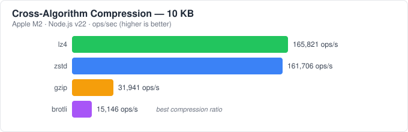
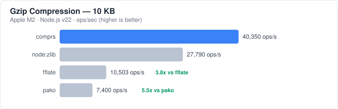

<div align="center">

# comprs

Rust-powered universal compression for JavaScript/TypeScript.
**zstd**, **gzip**, **brotli**, and **lz4** in one package.

[](https://www.npmjs.com/package/@derodero24/comprs)
[](https://www.npmjs.com/package/@derodero24/comprs)
[](https://github.com/derodero24/comprs/actions/workflows/ci.yml)
[](https://codecov.io/gh/derodero24/comprs)
[](https://codspeed.io/derodero24/comprs)
[](LICENSE)
[](https://nodejs.org/)
[](https://www.typescriptlang.org/)
[](https://derodero24.github.io/comprs/)

**[→ Try the live playground](https://derodero24.github.io/comprs/)**

</div>

## Table of Contents

- [Why comprs?](#why-comprs)
- [Comparison with Alternatives](#comparison-with-alternatives)
- [Installation](#installation)
- [Quick Start](#quick-start)
- [Choosing an Algorithm](#choosing-an-algorithm)
- [API](#api)
- [Unified API (`@derodero24/comprs/next`)](#unified-api-derodero24comprsnext)
- [Supported Algorithms](#supported-algorithms)
- [Platform Support](#platform-support)
- [Browser Usage](#browser-usage)
- [Migration](#migration)
- [Benchmarks](#benchmarks)
- [Contributing](#contributing)

## Why comprs?

The JavaScript compression ecosystem is fragmented across 12+ packages with inconsistent APIs and mixed maintenance status. comprs consolidates this into a single, fast, well-typed library:

- **Native performance** — Rust core compiled via napi-rs, with a WebAssembly build for browsers
- **Unified API** — Same interface for zstd, gzip, brotli, and lz4
- **Streaming** — Web Streams API (`TransformStream`) for processing large data with bounded memory, in Node.js and browsers, except brotli-dictionary compression streams, which buffer the whole input (see [Notes](#notes))
- **Universal** — Node.js, Deno, and Bun (native), and browsers (WebAssembly)
- **Zero JS dependencies** — Only Rust and the platform
- **Interactive playground** — [Try any algorithm live in your browser](https://derodero24.github.io/comprs/), no install needed

## Comparison with Alternatives

| Feature | comprs | pako | fflate | node:zlib |
| --- | :---: | :---: | :---: | :---: |
| zstd | ✅ | ❌ | ❌ | ⚠️ Experimental* |
| gzip/deflate | ✅ | ✅ | ✅ | ✅ |
| brotli | ✅ | ❌ | ❌ | ✅ |
| lz4 | ✅ | ❌ | ❌ | ❌ |
| Web Streams API | ✅ | ❌ | ❌ | ❌ |
| Node.js Transform | ✅ | ❌ | ❌ | ✅ |
| Streaming | ✅ | Chunked† | ✅ | ✅ |
| Browser | ✅ | ✅ | ✅ | ❌ |
| Deno/Bun | ✅ | ✅ | ✅ | ✅‡ |
| Native performance | ✅ | ❌ | ❌ | ✅ |
| TypeScript | ✅ | ✅ | ✅ | ✅ |
| Dictionary | zstd, brotli | deflate | deflate | deflate; zstd (Node.js 22.19+, 24.6+) |
| Zero JS deps | ✅ | ✅ | ✅ | ✅ |

\* `node:zlib` zstd support requires Node.js ≥ 22.15 and is experimental\
† pako uses chunked `Inflate`/`Deflate` classes, not the Web Streams API\
‡ Deno 2 and Bun implement `node:zlib`

## Installation

```bash
npm install @derodero24/comprs
# or
pnpm add @derodero24/comprs
# or
yarn add @derodero24/comprs
# or
bun add @derodero24/comprs
```

## Quick Start

> **Try it live** → [derodero24.github.io/comprs](https://derodero24.github.io/comprs/)

```typescript
import { zstdCompress, zstdDecompress } from '@derodero24/comprs';

const data = Buffer.from('Hello, comprs!');
const compressed = zstdCompress(data);
const decompressed = zstdDecompress(compressed);
```

All algorithms use the same pattern:

```typescript
import { gzipCompress, brotliCompress, lz4Compress } from '@derodero24/comprs';

const gzipped = gzipCompress(data);    // gzip
const brotlied = brotliCompress(data); // brotli
const lz4ed = lz4Compress(data);       // lz4
```

### Streaming (Web Streams API)

```typescript
import { createGzipCompressStream } from '@derodero24/comprs/streams';

const response = await fetch('https://example.com/data.json');
if (!response.body) throw new Error('Response has no body');

// Pipe through a compression TransformStream
const compressed = response.body.pipeThrough(createGzipCompressStream());
```

### Streaming (Node.js Transform)

```typescript
import { createGzipCompressTransform } from '@derodero24/comprs/node';
import { pipeline } from 'node:stream/promises';
import { createReadStream, createWriteStream } from 'node:fs';

await pipeline(
  createReadStream('input.txt'),
  createGzipCompressTransform(),
  createWriteStream('output.gz'),
);
```

### Auto-detect

```typescript
import { decompress } from '@derodero24/comprs';

// Works with any supported format — no need to know the algorithm
const decompressed = decompress(compressedData);

// Limit the decompressed size (default: 256 MB)
const limited = decompress(compressedData, 10 * 1024 * 1024);
```

zstd, gzip and LZ4 are recognized by their magic numbers. Brotli has none, so it is recognized heuristically, by decoding up to the first 64 KiB of the data: a truncated brotli stream, or other data that happens to pass for brotli, makes `decompress()` throw the same error as data of unknown format. The auto-detecting streams buffer up to 64 KiB of input to detect the format. Raw deflate cannot be detected: use `deflateDecompress()` for it.

`detectFormat()` returns the format, without decompressing, as a member of the `CompressionFormat` enum. Compare it with a member, such as `CompressionFormat.Zstd`, which also lets TypeScript check that a `switch` over the members handles every format, or with the member's value, one of the strings `'zstd'`, `'gzip'`, `'brotli'`, `'lz4'` and `'unknown'`. The members are not enumerable: `Object.keys(CompressionFormat)` and `Object.values(CompressionFormat)` return `[]`, so use them by name.

### Async

```typescript
import { gzipCompressAsync, gzipDecompressAsync } from '@derodero24/comprs';

// In Node.js, runs on the libuv thread pool — keeps the event loop free
const compressed = await gzipCompressAsync(largeData);
const decompressed = await gzipDecompressAsync(compressed);
```

### Compression levels

```typescript
import { zstdCompress } from '@derodero24/comprs';

zstdCompress(data, 1);   // fast compression
zstdCompress(data);      // default (level 3)
zstdCompress(data, 22);  // best compression
zstdCompress(data, -1);  // fast mode with negative levels
```

### Dictionary compression

```typescript
import { zstdTrainDictionary, zstdCompressWithDict, zstdDecompressWithDict } from '@derodero24/comprs';

// Train from samples of similar data
const dict = zstdTrainDictionary(samples);

// Compress/decompress with dictionary
const compressed = zstdCompressWithDict(data, dict);
const decompressed = zstdDecompressWithDict(compressed, dict);
```

```typescript
// Brotli dictionary (no training step — provide raw dictionary bytes)
import { brotliCompressWithDict, brotliDecompressWithDict } from '@derodero24/comprs';

const dict = Buffer.from('{"id":0,"name":"","email":"@example.com"}'.repeat(10));
const compressed = brotliCompressWithDict(data, dict);
const decompressed = brotliDecompressWithDict(compressed, dict);
```

`zstdCompressWithDict()` and `zstdDecompressWithDict()` digest the dictionary on every call, which costs far more than compressing a small message. For many small messages, a `Dictionary` of the unified API digests it once (see [Prepared dictionaries](#prepared-dictionaries)).

### Deno / Bun

```typescript
// Deno
import { gzipCompress } from 'npm:@derodero24/comprs';

// Bun (same as Node.js)
import { gzipCompress } from '@derodero24/comprs';
```

Both runtimes load the native addon, as Node.js does. Deno needs permission for it: run with `--allow-ffi --allow-read --allow-env`, or `--allow-all`. Without `--allow-ffi`, the import fails with a misleading `Cannot find native binding` error, which blames a bug in npm. Deno also needs a local `node_modules` directory, which holds the platform package with the binary: set `"nodeModulesDir": "auto"` in `deno.json`, or install the package into a local `node_modules` with npm.

## Choosing an Algorithm

| Use case | Recommended | Why |
| --- | --- | --- |
| Web asset delivery (CDN, HTTP) | **brotli** | Best compression ratio; native browser `Accept-Encoding` support |
| General-purpose file compression | **zstd** | Fastest all-round with excellent compression ratio |
| Real-time data / logging / IPC | **lz4** | Lowest latency; optimized for speed over ratio |
| Legacy systems / maximum compatibility | **gzip** | Universal support; every tool and platform can decompress |
| Many small similar records (JSON, logs) | **zstd + dictionary** | Dictionary pre-seeds the compressor with expected patterns |
| Brotli with domain-specific data | **brotli + dictionary** | Custom dictionary for repeated structures without training |

### Choosing an API mode

| Mode | When to use |
| --- | --- |
| **Sync** (`zstdCompress`) | Small data (< 1 MB), low-latency requirements, scripts |
| **Async** (`zstdCompressAsync`) | Large data or when the Node.js event loop must stay free (servers); browsers run them on the calling thread |
| **Streaming** (`createZstdCompressStream`) | Unknown/unbounded data size, memory-constrained environments |
| **Dictionary** (`zstdCompressWithDict`) | Compressing many small, structurally similar items |

The Web Streams and Node.js Transforms process each chunk synchronously on the calling thread, so the event loop is blocked while a chunk is compressed or decompressed. `node:zlib` streams [use the libuv thread pool](https://nodejs.org/api/zlib.html#threadpool-usage-and-performance-considerations) instead. For large inputs where event-loop latency matters, use the `*Async` one-shot functions or a worker thread.

## API

### One-shot

#### zstd

| Function | Description |
| --- | --- |
| `zstdCompress(data, level?)` | Compress with zstd. Level: -131072 to 22 (default: 3) |
| `zstdDecompress(data)` | Decompress zstd data (max 256 MB output) |
| `zstdDecompressWithCapacity(data, capacity)` | Decompress with explicit output size limit |

#### gzip / deflate

| Function | Description |
| --- | --- |
| `gzipCompress(data, level?)` | Compress with gzip. Level: 0-9 (default: 6) |
| `gzipCompressWithHeader(data, header, level?)` | Compress with custom gzip header (filename, mtime) |
| `gzipReadHeader(data)` | Read gzip header metadata without decompressing |
| `gzipDecompress(data)` | Decompress gzip data |
| `gzipDecompressWithCapacity(data, capacity)` | Decompress with explicit output size limit |
| `deflateCompress(data, level?)` | Compress with raw deflate. Level: 0-9 (default: 6) |
| `deflateDecompress(data)` | Decompress raw deflate data |
| `deflateDecompressWithCapacity(data, capacity)` | Decompress with explicit output size limit |

#### brotli

| Function | Description |
| --- | --- |
| `brotliCompress(data, quality?)` | Compress with brotli. Quality: 0-11 (default: 6) |
| `brotliDecompress(data)` | Decompress brotli data (max 256 MB output) |
| `brotliDecompressWithCapacity(data, capacity)` | Decompress with explicit output size limit |

#### lz4

| Function | Description |
| --- | --- |
| `lz4Compress(data)` | Compress with LZ4 frame format, with a content checksum |
| `lz4Decompress(data)` | Decompress LZ4 data, including concatenated, skippable and legacy frames (max 256 MB output) |
| `lz4DecompressWithCapacity(data, capacity)` | Decompress with explicit output size limit |

#### Auto-detect

| Function | Description |
| --- | --- |
| `decompress(data, maxOutputSize?)` | Auto-detect format and decompress (zstd, gzip, brotli, lz4). `maxOutputSize` limits the output (default: 256 MB) |
| `detectFormat(data)` | Detect compression format. Returns a `CompressionFormat`: `'zstd'`, `'gzip'`, `'brotli'`, `'lz4'`, or `'unknown'` |

#### Utilities

| Function | Description |
| --- | --- |
| `crc32(data, initialValue?)` | Compute CRC32 checksum (supports incremental computation) |
| `version()` | Returns the library version |

<details>
<summary><strong>Dictionary API</strong></summary>

#### zstd Dictionary

| Function | Description |
| --- | --- |
| `zstdTrainDictionary(samples, maxDictSize?)` | Train a dictionary from sample data (default max: 110 KB, limit: 16 MB) |
| `zstdCompressWithDict(data, dict, level?)` | Compress with pre-trained dictionary |
| `zstdDecompressWithDict(data, dict)` | Decompress dictionary-compressed data |
| `zstdDecompressWithDictWithCapacity(data, dict, capacity)` | Decompress with dictionary and explicit output size limit |

#### Brotli Dictionary

| Function | Description |
| --- | --- |
| `brotliCompressWithDict(data, dict, quality?)` | Compress with custom dictionary |
| `brotliDecompressWithDict(data, dict)` | Decompress dictionary-compressed data |
| `brotliDecompressWithDictWithCapacity(data, dict, capacity)` | Decompress with explicit capacity |

</details>

### Async

All one-shot functions have async variants that run on the libuv thread pool. Append `Async` to any function name. In browsers, they run on the calling thread instead (see [Browser Usage](#browser-usage)):

```typescript
const compressed = await zstdCompressAsync(data, level);
const decompressed = await gzipDecompressAsync(compressed);
```

They report every error through the returned Promise, invalid arguments included: they reject with the error that the synchronous function throws for the same arguments and never throw themselves, so `.catch()` or `await` inside `try` handles all of them.

<details>
<summary><strong>Full async API list</strong></summary>

| Function | Description |
| --- | --- |
| `zstdCompressAsync(data, level?)` | Async zstd compression |
| `zstdDecompressAsync(data)` | Async zstd decompression |
| `zstdDecompressWithCapacityAsync(data, capacity)` | Async zstd decompression with explicit size limit |
| `zstdCompressWithDictAsync(data, dict, level?)` | Async zstd compression with dictionary |
| `zstdDecompressWithDictAsync(data, dict)` | Async zstd decompression with dictionary |
| `zstdDecompressWithDictWithCapacityAsync(data, dict, capacity)` | Async zstd decompression with dictionary and size limit |
| `zstdTrainDictionaryAsync(samples, maxDictSize?)` | Async dictionary training |
| `gzipCompressAsync(data, level?)` | Async gzip compression |
| `gzipDecompressAsync(data)` | Async gzip decompression |
| `gzipDecompressWithCapacityAsync(data, capacity)` | Async gzip decompression with explicit size limit |
| `deflateCompressAsync(data, level?)` | Async deflate compression |
| `deflateDecompressAsync(data)` | Async deflate decompression |
| `deflateDecompressWithCapacityAsync(data, capacity)` | Async deflate decompression with explicit size limit |
| `brotliCompressAsync(data, quality?)` | Async brotli compression |
| `brotliDecompressAsync(data)` | Async brotli decompression |
| `brotliDecompressWithCapacityAsync(data, capacity)` | Async brotli decompression with explicit size limit |
| `brotliCompressWithDictAsync(data, dict, quality?)` | Async brotli compression with dictionary |
| `brotliDecompressWithDictAsync(data, dict)` | Async brotli decompression with dictionary |
| `brotliDecompressWithDictWithCapacityAsync(data, dict, capacity)` | Async brotli decompression with dictionary and size limit |
| `lz4CompressAsync(data)` | Async LZ4 compression |
| `lz4DecompressAsync(data)` | Async LZ4 decompression |
| `lz4DecompressWithCapacityAsync(data, capacity)` | Async LZ4 decompression with explicit size limit |
| `decompressAsync(data, maxOutputSize?)` | Async auto-detect format and decompress, with an optional output size limit |

</details>

The `*Async` functions copy their input (data, dictionary or training samples) on the calling thread before they hand the work to the thread pool, and keep no reference to it: changing or transferring the input once the call has returned is safe and does not affect the result. The copy blocks the event loop for about 0.6 ms per MB; for very large inputs, call the functions from a worker thread.

### Streaming

Web Streams API (`TransformStream`) for all algorithms, in Node.js, Deno, Bun and browsers. Import from `@derodero24/comprs/streams`:

```typescript
import { createGzipCompressStream } from '@derodero24/comprs/streams';
```

The package root re-exports the stream helpers for `import` only, and not in browsers (see [Browser Usage](#browser-usage)); `@derodero24/comprs/streams` works with both `import` and `require()`.

These streams accept the chunks that `CompressionStream` accepts, any `ArrayBuffer` or `ArrayBufferView` (a `DataView`, a `Uint16Array`, ...), as well as a `SharedArrayBuffer`, and read them byte for byte, both with the native addon (Node.js, Deno and Bun) and in the browser build.

<details>
<summary><strong>Full streaming API list</strong></summary>

| Function | Description |
| --- | --- |
| `createZstdCompressStream(level?)` | Create a zstd compression `TransformStream` |
| `createZstdDecompressStream(maxOutputSize?)` | Create a zstd decompression `TransformStream` |
| `createGzipCompressStream(level?)` | Create a gzip compression `TransformStream` |
| `createGzipDecompressStream(maxOutputSize?)` | Create a gzip decompression `TransformStream` |
| `createDeflateCompressStream(level?)` | Create a raw deflate compression `TransformStream` |
| `createDeflateDecompressStream(maxOutputSize?)` | Create a raw deflate decompression `TransformStream` |
| `createBrotliCompressStream(quality?)` | Create a brotli compression `TransformStream` |
| `createBrotliDecompressStream(maxOutputSize?)` | Create a brotli decompression `TransformStream` |
| `createLz4CompressStream()` | Create an LZ4 compression `TransformStream` |
| `createLz4DecompressStream(maxOutputSize?)` | Create an LZ4 decompression `TransformStream` |
| `createZstdCompressDictStream(dict, level?)` | Streaming zstd compression with dictionary |
| `createZstdDecompressDictStream(dict, maxOutputSize?)` | Streaming zstd decompression with dictionary |
| `createBrotliCompressDictStream(dict, quality?)` | Streaming brotli compression with dictionary |
| `createBrotliDecompressDictStream(dict, maxOutputSize?)` | Streaming brotli decompression with dictionary |
| `createDecompressStream(maxOutputSize?)` | Auto-detect format and create a decompression `TransformStream` |

</details>

The streams and the Node.js Transforms are built on the stream contexts that the package root exports (`ZstdCompressContext`, `GzipDecompressContext` and so on), which take chunks with `transform(chunk)`, return buffered output with `flush()`, and end the stream with `finish()`. `Lz4DecompressContext` works in one of two modes:

| Mode | `transform(chunk)` | `flush()` | `finish()` | `maxOutputSize` limits |
| --- | --- | --- | --- | --- |
| `new Lz4DecompressContext(maxOutputSize?)` | keeps the chunk and returns an empty buffer | decodes the input kept since the last `flush()`, which must end between frames | decodes what is left | the output of each `flush()` |
| `new Lz4DecompressContext(maxOutputSize?, { incremental: true })` | returns each block once all of it has arrived, and throws as soon as the input is invalid | returns an empty buffer | throws unless the input ended between frames | the output of the whole stream |

The default mode keeps the behaviour of earlier releases. The LZ4 decompression streams, including `createDecompressStream()` and `createDecompressTransform()` for LZ4 input, use the incremental mode. `options` must be an object, `undefined` or `null`, and `incremental` a boolean, `undefined` or `null`; other values throw.

### Node.js Transform Streams

For Node.js `stream.pipeline()` compatibility, import from `@derodero24/comprs/node`. This subpath is built on `node:stream`, so it does not work in browsers:

```typescript
import { createGzipCompressTransform } from '@derodero24/comprs/node';
import { pipeline } from 'node:stream/promises';
import { createReadStream, createWriteStream } from 'node:fs';

await pipeline(
  createReadStream('input.txt'),
  createGzipCompressTransform(),
  createWriteStream('output.gz'),
);
```

The transforms push their output in chunks of at most `readableHighWaterMark` bytes (64 KiB by default, 16 KiB on Windows), even when a single small input chunk decompresses to many megabytes.

The chunks that one native call produces, for an input chunk or for the end of the input, are views of one buffer, as with `node:zlib`. When a result spans several chunks, the transforms mark its buffer as untransferable (Node.js already marks the buffer of a result larger than 2 MiB), so that on Node.js, transferring one of the chunks to a worker with `postMessage()` or `structuredClone()` throws a `DataCloneError` instead of detaching the others. Where the runtime cannot mark it, as in Bun 1.3 and Deno before 2.7.6, a transfer made while the transform pushes the chunk (from a `'data'` listener, or the `write()` of a stream it is piped to) fails the stream instead, and a later transfer still detaches the other chunks. A result that fits in one chunk can be transferred, except a result larger than 2 MiB on Node.js (see the **Result memory** note). To transfer any chunk, copy it with `new Uint8Array(chunk)` first.

<details>
<summary><strong>Full Node.js Transform API list</strong></summary>

| Function | Description |
| --- | --- |
| `createZstdCompressTransform(level?)` | Node.js Transform for zstd compression |
| `createZstdDecompressTransform(maxOutputSize?)` | Node.js Transform for zstd decompression |
| `createGzipCompressTransform(level?)` | Node.js Transform for gzip compression |
| `createGzipDecompressTransform(maxOutputSize?)` | Node.js Transform for gzip decompression |
| `createDeflateCompressTransform(level?)` | Node.js Transform for deflate compression |
| `createDeflateDecompressTransform(maxOutputSize?)` | Node.js Transform for deflate decompression |
| `createBrotliCompressTransform(quality?)` | Node.js Transform for brotli compression |
| `createBrotliDecompressTransform(maxOutputSize?)` | Node.js Transform for brotli decompression |
| `createLz4CompressTransform()` | Node.js Transform for LZ4 compression |
| `createLz4DecompressTransform(maxOutputSize?)` | Node.js Transform for LZ4 decompression |
| `createZstdCompressDictTransform(dict, level?)` | Node.js Transform for zstd dict compression |
| `createZstdDecompressDictTransform(dict, maxOutputSize?)` | Node.js Transform for zstd dict decompression |
| `createBrotliCompressDictTransform(dict, quality?)` | Node.js Transform for brotli dict compression |
| `createBrotliDecompressDictTransform(dict, maxOutputSize?)` | Node.js Transform for brotli dict decompression |
| `createDecompressTransform(maxOutputSize?)` | Auto-detect format and create a decompression Transform |

</details>

## Unified API (`@derodero24/comprs/next`)

`@derodero24/comprs/next` has one function per direction for every format, with an options object instead of a function per variant ([#577](https://github.com/derodero24/comprs/issues/577)). It works in Node.js, Deno and Bun, on the native addon, and in browsers, on the WebAssembly build. It reads and writes zlib data as well as raw deflate, returns plain `Uint8Array` results in every runtime, gives every error a stable `code`, and compresses zstd with worker threads in Node.js. The API of the package root does not change.

```typescript
import { compress, compressSync, decompress, decompressSync, detectFormat } from '@derodero24/comprs/next';

const data = new TextEncoder().encode('Hello, comprs!');

// The plain names are async, as in node:zlib; the *Sync variants are not.
const zstd = await compress(data, { format: 'zstd', level: 19 });
const restored = await decompress(zstd); // detects the format
detectFormat(zstd); // 'zstd'

const gzip = compressSync(data, { format: 'gzip', gzipHeader: { filename: 'hello.txt' } });
decompressSync(gzip, { format: 'gzip', maxOutputSize: 1024 * 1024 });

try {
  await decompress(body, { maxOutputSize: 10 * 1024 * 1024 });
} catch (error) {
  // 413 for a body that decompresses to more than 10 MiB, 400 for corrupt data and the like
  const status = error instanceof Error && 'code' in error && error.code === 'ERR_COMPRS_SIZE_LIMIT' ? 413 : 400;
}
```

| Function | Description |
| --- | --- |
| `compress(data, options)` | Compress `data` in `options.format`, on a thread of the libuv pool in Node.js |
| `compressSync(data, options)` | Compress `data` on the calling thread |
| `decompress(data, options?)` | Decompress `data`, in `options.format` or the format that detection finds, on a thread of the libuv pool in Node.js |
| `decompressSync(data, options?)` | Decompress `data` on the calling thread |
| `detectFormat(data)` | The format of `data`, as `decompress()` detects it, or `undefined` if it finds none |
| `trainDictionary(samples, options?)` | Train a zstd dictionary from an iterable of samples, on a thread of the libuv pool in Node.js |
| `trainDictionarySync(samples, options?)` | Train a zstd dictionary on the calling thread |
| `Dictionary.from(bytes, options)` | Prepare a zstd or brotli dictionary once, for every call that takes it as its `dictionary` (see [Prepared dictionaries](#prepared-dictionaries)) |

| Option | Of | Description |
| --- | --- | --- |
| `format` | compression (required), decompression | `'zstd'`, `'gzip'`, `'deflate'` (zlib), `'deflate-raw'`, `'brotli'` or `'lz4'`, by the names of the Compression Streams standard where it has one. Decompression also takes `'auto'`, the default, which detects every format but `'deflate-raw'` |
| `level` | compression | zstd: -131072 to 22, 3 by default, which 0 also selects. With a `Dictionary`, the default is the level that it was prepared for. gzip, deflate and deflate-raw: 0 to 9, 6 by default. brotli: 0 to 11, 6 by default. lz4 takes none |
| `dictionary` | compression, decompression | A `Dictionary`, or the bytes of a dictionary, which must not be empty, for zstd and brotli, such as one that `trainDictionary()` trained. Decompression needs the same dictionary, and with its bytes, a `format` |
| `gzipHeader` | compression | `{ filename?, mtime? }`: the name and the modification time, in seconds since the Unix epoch, that the gzip header holds. For gzip only |
| `workers` | compression | The number of threads that compress zstd data besides the calling one: 0, the default, to 256. For zstd only, and for the native addon only (see below) |
| `maxOutputSize` | decompression | The largest output, in bytes: 0 to `Number.MAX_SAFE_INTEGER`, 256 MiB by default |
| `maxSize` | dictionary training | The largest dictionary, in bytes: 0 to 16 MiB, 110 KiB by default |

Their inputs, options, results and errors follow these rules:

- **Inputs.** The data, the bytes of a dictionary and each sample may be any `ArrayBuffer`, `SharedArrayBuffer` or `ArrayBufferView`, such as a `Buffer`, a `DataView` or a `Uint16Array`, read byte for byte. Bytes in a `SharedArrayBuffer` are copied before they are read, so that another thread writing them cannot change them midway. The async functions copy their inputs before they return, so changing them afterwards does not change the result, and keep using a `Dictionary` that is closed afterwards.
- **Options.** Every option is checked, and an option of the wrong type, a number out of its range or not an integer (`NaN`, `1.5`), and an option that does not fit the format, such as a level for lz4, a dictionary for gzip or workers for brotli, fail with `ERR_COMPRS_INVALID_ARG`. Other properties of the options objects are ignored.
- **Results.** Every result is a plain `Uint8Array`, not a Node.js `Buffer`, over an `ArrayBuffer`, so the DOM typings accept it as a `BufferSource` or a `BlobPart`, as in `new Blob([result])` or `crypto.subtle.digest('SHA-256', result)`. Whether that `ArrayBuffer` can be transferred with `postMessage()` or `structuredClone()` is not guaranteed: copy a result with `slice()` to transfer it. Compression writes the bytes that the functions of the package root write at the same settings in the same build, such as `zstdCompress(data, level)`, or `deflateCompress(data, level)` for `'deflate-raw'`, unless zstd compresses with `workers`, or with a `Dictionary` above level 8, or with a `Dictionary` an input of more than 512 KiB or of at least 128 KiB and at least 6 times the `byteLength` of the dictionary (see [Prepared dictionaries](#prepared-dictionaries)).
- **Decompression.** The decoders are strict: data that ends before the end of the compressed stream, empty data included, fails with `ERR_COMPRS_TRUNCATED`, and data after its end with `ERR_COMPRS_CORRUPT_DATA`. zstd and lz4 data may hold several frames, and gzip data several members, which are decompressed one after the other. Without a `format`, data whose format detection does not find, empty data included, fails with `ERR_COMPRS_UNKNOWN_FORMAT`. Brotli data has no magic number, so detection decodes the start of the data, and data that it takes for brotli but that does not decode fails with `ERR_COMPRS_UNKNOWN_FORMAT` as well.
- **Errors.** Every error has a `code`, from the table below. The async functions report every error, invalid arguments included, by rejecting their Promise, and never throw. An error thrown by the caller's own code, such as a getter of an options object or the iterator of the samples, is passed on unchanged, without a code.

| `code` | When |
| --- | --- |
| `ERR_COMPRS_INVALID_ARG` | An argument or an option is invalid: of the wrong type, out of range, or not for the format. The error is a `TypeError` |
| `ERR_COMPRS_UNKNOWN_FORMAT` | Decompression without a `format` could not detect the format of the data, empty data included |
| `ERR_COMPRS_CORRUPT_DATA` | The data is not valid in its format, or has data after the end of the compressed stream |
| `ERR_COMPRS_TRUNCATED` | The data ends before the end of the compressed stream, as empty data in a given `format` does |
| `ERR_COMPRS_SIZE_LIMIT` | The output would exceed `maxOutputSize`, or, under a `maxOutputSize` of 64 MiB or less, a zstd frame declares a window larger than the limit allows (see the **Default decompression limit** note) |
| `ERR_COMPRS_STREAM_FINISHED` | A stream was used after it finished |
| `ERR_COMPRS_STREAM_CLOSED` | A stream was used after it was closed |
| `ERR_COMPRS_OPERATION_FAILED` | Any other failure, such as a failed allocation, or dictionary training that found too little to learn from |

Every error but `ERR_COMPRS_INVALID_ARG` is a plain `Error`. `ERR_COMPRS_STREAM_FINISHED` and `ERR_COMPRS_STREAM_CLOSED` report a misuse of a stream, not a problem with the data; the functions above do not give them. New codes may be added in minor releases, so treat a code that this table does not list as a failure of its own. The errors of the package root keep the codes of comprs 2.x: `InvalidArg` or `GenericFailure` in the native addon, and none in the WebAssembly build.

> [!WARNING]
> **`'deflate'` is zlib.** As in the Compression Streams standard, HTTP's `Content-Encoding: deflate` and `deflateSync()` of `node:zlib`, `'deflate'` is the zlib format (RFC 1950): deflate data after a 2-byte header and before an Adler-32 checksum. The `deflateCompress()` and `deflateDecompress()` functions of the package root, and their streams, use raw deflate (RFC 1951), which is `'deflate-raw'` here. Data that `deflateCompress()` wrote decompresses with `{ format: 'deflate-raw' }` only, and code that moves from `deflateCompress()` to `{ format: 'deflate' }` writes data that `deflateDecompress()` cannot read.

**Workers.** The `workers` option compresses zstd data on worker threads in the native addon; with 4 workers, it compressed 67 MB of JSON lines nearly 3 times as fast at levels 3 and 9 in the measurements of [#561](https://github.com/derodero24/comprs/issues/561). The output can differ from that without workers. zstd compresses inputs of at most 512 KiB on the calling thread whatever the number, and each call starts and stops its own workers, so they pay off for large inputs only. They cost memory too: zstd buffers up to `workers + 3` jobs of the input, gives each job an output buffer of about the same size, and gives each worker a compression context of its own. With 4 workers at level 3, where a job is 8 MiB, compressing 96 MiB took about 60 MiB more memory than without workers for JSON lines, and about 100 MiB more for random bytes. The workers are threads beyond the libuv pool that `compress()` runs on, whose size `UV_THREADPOOL_SIZE` sets (4 by default): concurrent calls can run up to `UV_THREADPOOL_SIZE * (workers + 1)` threads.

**Browsers.** Browser builds that import `@derodero24/comprs/next` get its WebAssembly build, through the `browser` condition, on the WebAssembly module of the browser entry (see [Browser Usage](#browser-usage)). There, the async functions do not run on another thread: they compress or decompress on the calling thread, which they block, before they return a Promise of the result. Use a Web Worker to keep a page responsive. The browser build has no worker threads either: any `workers` but 0 fails with `ERR_COMPRS_INVALID_ARG`. Its WebAssembly memory cannot hold more than 4 GiB, so a `maxOutputSize` above 4294967295 acts as 4294967295: errors name that limit, and a zstd frame that declares a larger content size fails with `ERR_COMPRS_SIZE_LIMIT`. It writes different lz4 frames from the native build for most inputs of more than a few hundred bytes, which both builds decode; the other formats come out the same in both. A panic, or an allocation that the WebAssembly memory cannot grow for, fails with a `WebAssembly.RuntimeError` without a code.

`@derodero24/comprs/next` follows semantic versioning, as the package root does: minor releases may add functions, options and error codes to it, but do not break it. Its TypeScript declarations also export the types of its arguments and results: `Format`, `Input`, `Bytes`, `ErrorCode`, `CompressOptions`, `DecompressOptions`, `GzipHeaderOptions`, `TrainDictionaryOptions` and `DictionaryOptions`.

### Prepared dictionaries

Dictionaries pay off for small messages, such as RPC payloads, cache entries and log lines, but zstd digests the bytes of a dictionary before it compresses or decompresses anything with them, which costs far more than a small message: a call that takes the bytes, such as `zstdCompressWithDict()` of the package root, digests them every time ([#557](https://github.com/derodero24/comprs/issues/557)). A `Dictionary` digests them once, for every call that takes it as its `dictionary`:

```typescript
import { compressSync, Dictionary, decompressSync, trainDictionarySync } from '@derodero24/comprs/next';

const dictionary = Dictionary.from(trainDictionarySync(samples), { format: 'zstd', level: 3 });

const compressed = compressSync(message, { format: 'zstd', dictionary });
decompressSync(compressed, { dictionary }); // in the format of the dictionary

dictionary.close(); // or declare it with `using`, which closes it at the end of the block
```

| Member | Description |
| --- | --- |
| `Dictionary.from(bytes, { format, level? })` | Prepare a dictionary for `'zstd'` or `'brotli'` from a copy of `bytes`, which must not be empty. A zstd dictionary is digested for compression at `level`, 3 by default, which 0 also selects, and for decompression. A brotli dictionary takes no level |
| `format` | `'zstd'` or `'brotli'` |
| `byteLength` | The size of the dictionary, in bytes |
| `toBytes()` | A copy of the bytes of the dictionary |
| `close()` | Free the memory of the dictionary now, rather than when the garbage collector collects it. `[Symbol.dispose]()` is the same method, for `using` declarations, where the runtime has `Symbol.dispose` |

- **Speed.** With the workload of [#557](https://github.com/derodero24/comprs/issues/557), 2,000 JSON messages of about 110 bytes and a trained dictionary of 110 KiB, compressing the messages one by one took 599 ms with `zstdCompressWithDict()` and 5.1 ms with a `Dictionary`, and decompressing them 78 ms with `zstdDecompressWithDict()` and 4.2 ms with a `Dictionary` (Node.js 22, Linux x64). Creating the `Dictionary` took 0.3 ms at level 3 and 12 ms at level 19.
- **Formats.** A `Dictionary` is for its `format` alone: with another format, the functions fail with `ERR_COMPRS_INVALID_ARG` ("this Dictionary is for zstd"). Decompression with a `Dictionary` and without a `format`, or with `'auto'`, decompresses in the format of the dictionary; with the bytes of a dictionary, it still needs a `format`. Data compressed with a `Dictionary` decompresses with its bytes, such as with `zstdDecompressWithDict()` of the package root, and the other way round.
- **Frames.** zstd compresses an input with the parameters that a `Dictionary` was prepared for, unless the input has at least 128 KiB and at least 6 times the `byteLength` of the dictionary: such an input gets parameters for its size, and its frames can differ from those of the bytes of the dictionary. Up to level 8, smaller inputs of at most 512 KiB get the frames that the bytes of the dictionary give at the same level, as from `zstdCompressWithDict()`. Above level 8, and for inputs of more than 512 KiB, zstd can write other frames with a `Dictionary` than with its bytes, as it sizes its window or splits blocks otherwise.
- **Levels.** Compression without a `level` compresses at the level of the `Dictionary`. Other levels work too: the dictionary digests each on its first use, which costs as much as creating a dictionary at that level, and keeps the last 3 of them.
- **Memory.** A zstd `Dictionary` holds memory outside the JavaScript heap: a copy of the bytes, a digest for decompression of about their size, and a digest for each compression level that it keeps, which grows with the level. A dictionary of 110 KiB holds 0.8 MB in all at level 3, and 2 MB at level 19. The native addon reports that memory to V8 when it creates the dictionary, so that the garbage collector weighs it, but not the memory of the levels that it digests later. `close()` frees the memory once the calls that already started with the dictionary have finished; any later call with it fails with `ERR_COMPRS_INVALID_ARG` ("this Dictionary is closed").
- **Brotli.** A brotli `Dictionary` only holds the bytes, which brotli takes as they are, so it saves little time yet: brotli still indexes the dictionary on every call.
- **Browsers.** The browser build has the same class. A `Dictionary` of one build is no dictionary of the other: pass it to the functions of the entry that created it.

## Supported Algorithms

| Algorithm | One-shot | Streaming | Status |
| --- | --- | --- | --- |
| zstd | ✅ | ✅ | Available |
| gzip / deflate | ✅ | ✅ | Available |
| brotli | ✅ | ✅ | Available |
| lz4 | ✅ | ✅ | Available |

## Platform Support

| Platform | Backend | Status |
| --- | --- | --- |
| Node.js ≥ 22 | Native (napi-rs) | ✅ |
| Deno | Native (napi-rs) | ✅ |
| Bun | Native (napi-rs) | ✅ |
| Browsers | WASM (wasm-bindgen) | ✅ |

Node.js, Deno, and Bun load a prebuilt native binary, which the package manager installs as an optional dependency on the platforms listed under [Build targets](#build-targets). In browsers, comprs uses its WebAssembly build instead (see [Browser Usage](#browser-usage)).

On any other platform, loading comprs in Node.js, Deno, or Bun throws `Cannot find native binding`: the WebAssembly build is not used as a fallback there. The error's `cause` chain lists every file and package the loader tried, and the innermost one names the platform, such as `Unsupported OS: aix, architecture: ppc64` or `./comprs.linux-riscv64-gnu.node`. On a listed platform, the same error means that the binary package was not installed, for example because optional dependencies were omitted. The chain also names `@derodero24/comprs-wasm32-wasi`: the loader that napi-rs generates still looks for this WASI build, which is no longer published (2.0.2 was its last version). Do not install it, as a newer comprs would load that outdated build.

### Build targets

| OS | Architectures |
| --- | --- |
| macOS | Intel (x64), Apple Silicon (ARM64) |
| Linux | x64, ARM64 (glibc & musl) |
| Windows | x64, ARM64 |
| WASM | wasm32-unknown-unknown (wasm-bindgen) |

The Linux glibc binaries need glibc 2.17 or newer. The Windows binaries link the C runtime statically, so they do not need the Visual C++ Redistributable.

### WASM bundle size

The browser WASM binary (`wasm32-unknown-unknown`) is built with `wasm-pack`, optimized for size (`opt-level = "s"`). It contains all four codecs.

| `comprs-wasm_bg.wasm` | Size |
| --- | --- |
| Raw | 1.90 MB |
| gzip (level 9) | 806 KB |
| brotli (quality 11) | 558 KB |

The compressed sizes are those of Node.js's zlib; what a CDN serves depends on its compressor and level. CI reports these sizes on every pull request, and fails when the raw or gzip size grows over its budget.

## Browser Usage

Browser builds that import `@derodero24/comprs` get its WebAssembly build, through the `browser` condition of the package's `exports`. Import the functions and call them; there is no initialization function to call:

```typescript
import { gzipCompress, gzipDecompress } from '@derodero24/comprs';

const data = new TextEncoder().encode('Hello from the browser!');
const compressed = gzipCompress(data);
const decompressed = gzipDecompress(compressed);
```

The entry module fetches and instantiates the WebAssembly binary with top-level `await` when it is imported, so every function works once the import has resolved, and a failed download rejects the import. It locates the binary, `browser/comprs-wasm_bg.wasm` in the package, with `new URL('./comprs-wasm_bg.wasm', import.meta.url)`, a pattern that webpack and Vite turn into an emitted asset; with other tools, copy the binary next to the bundle. The bundler must also support top-level `await`:

| Tool | What it needs |
| --- | --- |
| Vite 8 | Nothing, for `vite build` and `vite dev`. |
| Vite 7 and older | `vite dev` needs `optimizeDeps: { exclude: ['@derodero24/comprs'] }`, as the dependency pre-bundling of these versions breaks the URL of the binary. Before Vite 7, the default build target does not support top-level `await`: set `build.target: 'es2022'` or later. |
| webpack 5 | Nothing: it enables top-level `await` by default since 5.83 and emits the binary as an asset. |
| esbuild | `--format=esm` and a `--target` that supports top-level `await` (the default, `esnext`, does). esbuild leaves `new URL(…)` as it is, so copy `node_modules/@derodero24/comprs/browser/comprs-wasm_bg.wasm` next to the bundle. |
| No bundler | Serve the package's `browser/` directory, and map the package name to its entry with an import map: `<script type="importmap">{ "imports": { "@derodero24/comprs": "/node_modules/@derodero24/comprs/browser/index.js", "@derodero24/comprs/streams": "/node_modules/@derodero24/comprs/browser/streams.js", "@derodero24/comprs/next": "/node_modules/@derodero24/comprs/browser/next/browser.js" } }</script>` |

To import comprs in a web worker that Vite bundles, also set `worker: { format: 'es' }` and create the worker with `{ type: 'module' }`: Vite's default worker format, `'iife'`, does not support top-level `await`.

Serve `.wasm` files as `application/wasm`, which lets the browser compile the binary while it downloads; with another type, it falls back to slower compilation and logs a warning.

The Web Streams helpers of `@derodero24/comprs/streams` have a browser build as well, on the same WebAssembly module. Import them from that subpath: unlike the ES module entry of Node.js, the browser entry does not re-export them.

```typescript
import { createGzipDecompressStream } from '@derodero24/comprs/streams';

const response = await fetch('/data.json.gz');
if (!response.body) throw new Error('Response has no body');
const json = await new Response(response.body.pipeThrough(createGzipDecompressStream())).json();
```

The [unified API](#unified-api-derodero24comprsnext) of `@derodero24/comprs/next` has a browser build too, on the same WebAssembly module.

The WebAssembly build has the one-shot functions, their `*Async` variants, the streaming contexts (`GzipCompressContext` and the like) and the `CompressionFormat` enum. They take the same arguments as those of the native addon, and return the same values, except that:

- functions return `Uint8Array` rather than `Buffer`;
- the `*Async` functions do not run on another thread. Each one runs its synchronous function on the calling thread before it returns, and returns a Promise of the result: they keep code written for the native addon working, but block the page as long as the synchronous call. To keep a page responsive while it compresses large data, use comprs in a Web Worker. Every error, including an invalid argument, rejects the Promise and none is thrown, as with the native functions;
- the streaming contexts keep their state in WebAssembly memory, which garbage collection frees, and do not report it to the engine. As on Node.js, `close()` and `[Symbol.dispose]()` release that state at once; in addition, `free()` frees the context object itself. A closed or freed context throws when it is used. The streams of `@derodero24/comprs/streams` free their context as soon as they end or fail, and when they are cancelled, where the runtime calls the `cancel()` method of their transformer;
- a panic, which aborts the native addon, makes the WebAssembly build throw `RuntimeError: unreachable`, after it logs the panic message with `console.error()`.

As in Node.js, the streams work in bounded memory, except brotli dictionary compression, which holds its whole input until it ends. The WebAssembly memory grows to the most that the module has used at once, and does not shrink.

Its declarations, `browser/index.d.ts`, `browser/streams.d.ts` and `browser/next/browser.d.ts`, list what it exports; TypeScript uses them only when it resolves the `browser` condition (`"customConditions": ["browser"]` in `tsconfig.json`), and the Node.js declarations otherwise. The `browser` condition applies to `import` only: `require()` cannot load a module that uses top-level `await`, so `require('@derodero24/comprs')`, `require('@derodero24/comprs/streams')` and `require('@derodero24/comprs/next')` load the native addon, also in test runners that set the condition, such as Jest with a jsdom environment. Under Jest's ES module support, that environment imports the WebAssembly build, which does not load in Jest: set `testEnvironmentOptions: { customExportConditions: ['node', 'node-addons'] }` to get the native addon. The `@derodero24/comprs/node` subpath is for Node.js only: it loads the native addon and `node:stream`, so it does not work in browsers.

### Framework Integration (SSR)

Native modules need to be externalized in SSR frameworks:

**Next.js**

```js
// next.config.js
const nextConfig = {
  serverExternalPackages: ['@derodero24/comprs'],
};
```

**Vite SSR**

```js
// vite.config.js
export default {
  ssr: {
    external: ['@derodero24/comprs'],
  },
};
```

Client bundles resolve the `browser` condition and get the WebAssembly build, with the bundler setup described above.

## Migration

### From pako

```diff
- import pako from 'pako';
- const compressed = pako.gzip(data);
- const decompressed = pako.ungzip(compressed);
+ import { gzipCompress, gzipDecompress } from '@derodero24/comprs';
+ const compressed = gzipCompress(data);
+ const decompressed = gzipDecompress(compressed);
```

### From fflate

```diff
- import { gzipSync, gunzipSync } from 'fflate';
- const compressed = gzipSync(data);
- const decompressed = gunzipSync(compressed);
+ import { gzipCompress, gzipDecompress } from '@derodero24/comprs';
+ const compressed = gzipCompress(data);
+ const decompressed = gzipDecompress(compressed);
```

comprs adds what fflate lacks: zstd, brotli and LZ4, dictionaries for zstd and brotli, and the Web Streams API. fflate's deflate dictionaries (its `dictionary` option) have no counterpart in comprs.

### From node:zlib

```diff
- import { gzipSync, gunzipSync } from 'node:zlib';
- const compressed = gzipSync(data);
- const decompressed = gunzipSync(compressed);
+ import { gzipCompress, gzipDecompress } from '@derodero24/comprs';
+ const compressed = gzipCompress(data);
+ const decompressed = gzipDecompress(compressed);
```

## Benchmarks

The [Bench Report workflow](.github/workflows/bench-report.yml) regenerates the tables and charts below from one run of `scripts/bench-report.mjs` on a GitHub-hosted runner, with every library at the same settings, and states the versions, the machine and the settings above them (see [Regenerating the README benchmarks](CONTRIBUTING.md#regenerating-the-readme-benchmarks)). Run the benchmarks locally with `pnpm run bench`. Numbers vary by machine and data type. [CodSpeed](https://codspeed.io/derodero24/comprs) tracks the Rust benchmarks of `comprs-core` on the pull requests that change Rust code, to catch performance regressions.

comprs uses a pure-Rust brotli encoder: at equal quality, it is slower than `node:zlib`'s C encoder, especially for small inputs. Prefer zstd when speed matters.

<!-- bench:start -->
> [!WARNING]
> These tables and charts are out of date. They were measured in March 2026, before comprs 1.0, on an Apple M2 with Node.js 22, with each library at its default level, and count operations per second. The next run of the Bench Report workflow replaces them with speeds in MB/s and compression ratios, at equal settings ([#556](https://github.com/derodero24/comprs/issues/556)).





<details>
<summary><strong>gzip: comprs vs pako vs fflate vs node:zlib</strong></summary>

**Compression** (ops/sec, higher is better)

| Size | comprs | pako | fflate | node:zlib |
| --- | ---: | ---: | ---: | ---: |
| 150B patterned | 1,352 | 1,578 | 7,785 | 13,078 |
| 10KB patterned | 3,605 | 133 | 345 | 1,878 |
| 1MB patterned | 246 | 14 | 11 | 100 |
| 150B random | 29,914 | 4,653 | 7,471 | 1,423 |
| 10KB random | 400 | 42 | 652 | 3,459 |
| 1MB random | 13 | 5 | 6 | 10 |

**Decompression** (ops/sec, higher is better)

| Size | comprs | pako | fflate | node:zlib |
| --- | ---: | ---: | ---: | ---: |
| 150B patterned | 162,220 | 65,141 | 521,933 | 308,493 |
| 10KB patterned | 95,300 | 19,235 | 46,402 | 102,585 |
| 1MB patterned | 903 | 123 | 310 | 1,451 |
| 150B random | 29,040 | 1,952 | 560,840 | 140,243 |
| 10KB random | 7,004 | 17,616 | 407,789 | 271,245 |
| 1MB random | 1,508 | 278 | 19,341 | 4,282 |

</details>

<details>
<summary><strong>deflate: comprs vs pako vs fflate vs node:zlib</strong></summary>

**Compression** (ops/sec, higher is better)

| Size | comprs | pako | fflate | node:zlib |
| --- | ---: | ---: | ---: | ---: |
| 150B patterned | 106,183 | 13,666 | 55,434 | 4,107 |
| 10KB patterned | 2,746 | 5,160 | 3,218 | 7,161 |
| 1MB patterned | 1,963 | 91 | 217 | 472 |
| 150B random | 56,537 | 18,763 | 51,817 | 89,617 |
| 10KB random | 7,331 | 1,500 | 510 | 1,941 |
| 1MB random | 21 | 8 | 24 | 22 |

**Decompression** (ops/sec, higher is better)

| Size | comprs | pako | fflate | node:zlib |
| --- | ---: | ---: | ---: | ---: |
| 150B patterned | 124,501 | 21,119 | 8,938 | 34,967 |
| 10KB patterned | 23,416 | 5,808 | 3,061 | 9,753 |
| 1MB patterned | 306 | 65 | 70 | 116 |
| 150B random | 35,178 | 11,449 | 204,088 | 91,795 |
| 10KB random | 7,986 | 13,079 | 62,782 | 114,130 |
| 1MB random | 610 | 350 | 238 | 176 |

</details>

<details>
<summary><strong>Cross-algorithm comparison (comprs only)</strong></summary>

**Compression** (ops/sec, higher is better)

| Size | zstd | gzip | brotli | lz4 |
| --- | ---: | ---: | ---: | ---: |
| 150B patterned | 515,284 | 78,073 | 24,300 | 274,935 |
| 10KB patterned | 161,706 | 31,941 | 15,146 | 165,821 |
| 1MB patterned | 5,607 | 2,252 | 642 | 4,153 |
| 150B random | 643,393 | 69,616 | 23,634 | 97,111 |
| 10KB random | 129,576 | 31,525 | 13,411 | 74,162 |
| 1MB random | 4,320 | 2,262 | 478 | 5,419 |
| JSON 84KB | 8,914 | 1,828 | 758 | 4,531 |
| text 45KB | 52,262 | 31,111 | 8,022 | 22,953 |

**Decompression** (ops/sec, higher is better)

| Size | zstd | gzip | brotli | lz4 |
| --- | ---: | ---: | ---: | ---: |
| 150B patterned | 510,595 | 433,472 | 132,960 | 291,921 |
| 10KB patterned | 224,034 | 135,437 | 24,028 | 84,465 |
| 1MB patterned | 3,206 | 2,561 | 303 | 1,806 |
| 150B random | 461,787 | 441,290 | 30,870 | 371,571 |
| 10KB random | 245,513 | 135,314 | 23,516 | 89,173 |
| 1MB random | 3,498 | 2,309 | 656 | 1,792 |
| JSON 84KB | 17,345 | 9,737 | 4,644 | 20,356 |
| text 45KB | 82,783 | 29,115 | 3,415 | 41,811 |

</details>
<!-- bench:end -->

### Key takeaways

- **zstd is the fastest** all-round: highest throughput for both compression and decompression across most data sizes
- **gzip/deflate decompression**: performance varies by format and data; comprs leads on patterned deflate data, while fflate or `node:zlib` is faster on gzip and on small random payloads
- **Native addon only**: these numbers are from the native (napi-rs) addon; the WebAssembly build was not measured

## Notes

> [!NOTE]
> **Default decompression limit**: All decompression functions cap output at 256 MB by default. Use `*WithCapacity()` variants, or the `maxOutputSize` argument of `decompress()` and `decompressAsync()`, for larger data:
> ```typescript
> const decompressed = zstdDecompressWithCapacity(data, 1024 * 1024 * 1024); // 1 GB
> ```
> The capacity is a limit, not an allocation size: output buffers grow with the decompressed data, so a large capacity reserves no memory up front, and size fields in the input (the zstd frame content size, the gzip size trailer) are trusted only as far as the input can expand. Output over the limit throws an `... exceeded maximum size of <limit> bytes` error.
> Streaming decompression takes the limit as its `maxOutputSize` argument and enforces it while decoding: memory stays near `maxOutputSize` even when a single small chunk would expand to gigabytes.
> A zstd frame header can declare a window, or for a single-segment frame a content size, of up to 128 MiB, which the streaming decoder allocates as soon as it has read the header, before it writes any output. Stream contexts decode every frame this way; the one-shot functions decode frames that declare their content size in one pass into a buffer of that size, which the limit bounds, and only other input, such as frames without a content size, this way. The limit also bounds the window, to the limit rounded up to a power of two but at least 8 MiB, enough for the frames that zstd writes at levels up to 19, and at most zstd's own bound of 128 MiB. A limit of 64 MiB or less lowers zstd's bound: a frame whose window exceeds the lowered bound throws `zstd frame window exceeded maximum size of <limit> bytes`, the size-limit error, instead of reserving the window. Raising the limit decodes such a frame if its window is at most 128 MiB; a window over 128 MiB throws the same error, although no limit decodes it. A limit of more than 64 MiB, such as the default, keeps zstd's bound of 128 MiB, and a frame whose window exceeds it throws zstd's `Frame requires too much memory for decoding` corrupt-data error.

> [!NOTE]
> **Numeric arguments**: levels, qualities, `capacity`, `maxOutputSize`, `maxDictSize`, the `crc32()` initial value and the gzip header `mtime` must be integers in their documented ranges. Other numbers, such as `NaN`, `Infinity`, `1.5` or `2 ** 32`, throw an error that names the argument and its range instead of being converted to a valid value (the async functions reject with it). `capacity` and `maxOutputSize` range from 0 to `Number.MAX_SAFE_INTEGER`, the same on every platform, and a limit of 0 accepts only data that decompresses to nothing; `maxDictSize` ranges from 0 to 16 MiB (16777216).

> [!NOTE]
> **Truncated and empty input**: zstd, gzip, deflate and brotli decompression throw when the input ends before the compressed stream does, so an interrupted download or a partial file is never returned as a shorter result. Streams check this when their input ends; the decompression contexts check it in `finish()` (`Lz4DecompressContext` without `{ incremental: true }` already in `flush()`). Empty input throws for every format, because no format has a valid zero-length encoding (`node:zlib` rejects it for gzip, deflate and brotli too): format-specific functions and streams report `<format> stream is truncated: unexpected end of input`, and auto-detection reports that it cannot detect the format.

> [!NOTE]
> **Stream context memory**: the stream contexts (`ZstdCompressContext`, `GzipDecompressContext` and so on, which the streams use) keep their encoder or decoder state in native memory: up to a few hundred kilobytes for gzip, deflate and LZ4 compression, several megabytes for zstd and brotli, and far more at high levels (about 90 MB for zstd level 19). They report it to V8, so that the garbage collector frees abandoned contexts in time. `finish()` releases it right away, and so does `close()` for a context that will not be finished; later calls throw `<format> stream already closed`. An `Lz4DecompressContext` holds the input it buffers, or with `{ incremental: true }` at most one block of input (up to 4 MiB, or a little over 8 MiB in a legacy frame) and, for frames whose blocks refer to earlier ones, up to 128 KiB of output. The buffer that LZ4 decompression decodes blocks into is not part of this state: the thread keeps it, see the LZ4 decode buffer note below. Contexts are disposable, so `using ctx = new ZstdCompressContext()` closes the context at the end of the scope. The Web streams and Node.js Transforms close their context when they end, fail, or are cancelled or destroyed. Closing a cancelled Web stream relies on the `cancel()` hook of `TransformStream` transformers, which Node.js supports; runtimes without it, such as Bun 1.3, leave the context to the garbage collector.

> [!NOTE]
> **One-shot zstd contexts**: `zstdCompress()`, `zstdDecompress()`, `zstdDecompressWithCapacity()` and their `*Async` variants, and `decompress()` for zstd input, keep one compression and one decompression context per thread instead of creating one per call (the calling thread for the synchronous functions, the libuv pool threads for `*Async`), which makes small calls several times faster. A thread keeps a context only while it holds at most 8 MiB, so a large or high-level call does not leave its workspace behind; this memory is not reported to V8. The dictionary functions create a context per call.

> [!NOTE]
> **LZ4 decode buffer**: LZ4 decompression (`lz4Decompress()`, `lz4DecompressWithCapacity()` and their `*Async` variants, `decompress()` and `decompressAsync()` for LZ4 input, `Lz4DecompressContext` and the LZ4 decompression streams) keeps the buffer that it decodes blocks into per thread instead of zero-filling a new one per call (the calling thread for the synchronous functions, the contexts and the streams, the libuv pool threads for `*Async`), which makes frames that declare large blocks, such as the 4 MB blocks that the `lz4` CLI declares by default, much faster to decode. A thread keeps the buffer only while it holds at most 4 MiB, so the buffer of up to 8 MiB that a large block of a legacy frame (`lz4 -l`) needs is not kept; this memory is not reported to V8.

> [!NOTE]
> **Result memory**: in the native addon (Node.js, Bun, Deno), the synchronous functions and the stream contexts return results of up to 2 MiB in memory that the JavaScript engine allocates. The engine frees it as soon as it collects the result, and such a result can be transferred to a worker with `postMessage()` or `structuredClone()`. Larger results and the results of the `*Async` functions stay in the memory that the addon allocated, which saves a copy, and so does the `extra` field of `gzipReadHeader()`. Node.js frees that memory only on a later turn of the event loop, after V8 has collected the result, so a synchronous loop that returns large results holds the memory of all of them until it yields (an occasional `await new Promise(setImmediate)` releases it). Node.js also marks that memory as untransferable, so transferring such a result throws a `DataCloneError` there: copy it with `new Uint8Array(result)` first. The Web streams emit plain `Uint8Array` chunks, each with an `ArrayBuffer` of its own, which can always be transferred. The WebAssembly build returns every result as a copy in JavaScript memory, which can be transferred at any size.

> [!NOTE]
> **Small payloads on WASM**: For data under ~1 KB, the WASM runtime overhead may exceed compression time. Consider batching small items or using the native Node.js backend where possible.

> [!NOTE]
> **Streams that buffer their input**: brotli dictionary compression streams (`createBrotliCompressDictStream()`, `createBrotliCompressDictTransform()`) hold their whole input in memory and produce their output only when the input ends. The other streams in `@derodero24/comprs/streams` and `@derodero24/comprs/node` work in bounded memory: LZ4 decompression streams, for example, emit each block as soon as all of it has arrived and hold at most one block of their input. Removing this buffering is tracked in [#565](https://github.com/derodero24/comprs/issues/565).

## Ecosystem

### [`@derodero24/comprs-middleware`](packages/middleware/)

HTTP compression middleware for Express, Fastify, and Hono.

```bash
npm install @derodero24/comprs @derodero24/comprs-middleware
```

```ts
// Express
import { comprs } from '@derodero24/comprs-middleware/express';
app.use(comprs());

// Fastify
import { comprs } from '@derodero24/comprs-middleware/fastify';
app.register(comprs);

// Hono
import { comprs } from '@derodero24/comprs-middleware/hono';
app.use(comprs());
```

See the [middleware README](packages/middleware/README.md) for full documentation.

## Contributing

See [CONTRIBUTING.md](CONTRIBUTING.md) for development setup and guidelines.

## Security

See [SECURITY.md](SECURITY.md) for vulnerability reporting.

## License

[MIT](LICENSE)
